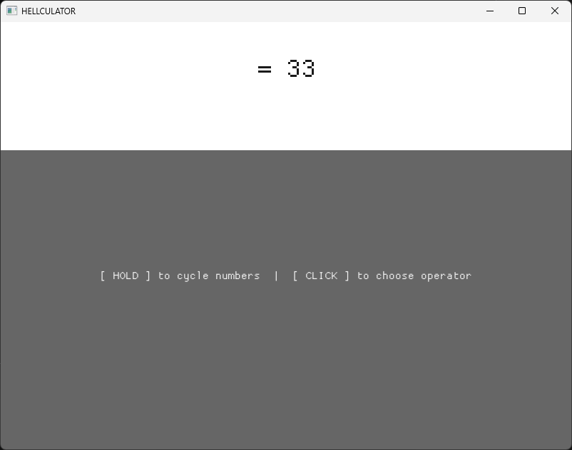

# Hellculator
My try at a simple and bad(intentionally) calculator, made with bengine(my OpenGL renderer) as base! This project inspired me to create a simple UI implementation on the main engine repo! This was made in my engine because at the time of development I was not familar with popular UI and window libraries.

---
## Note:
the reason this repo has such less commits is because I was making commits in the wrong repo ;-;

## Usage:
* click and hold the mouse on the grey area to cycle through digits and leave once reached the desired digit.
* manually select each of the digits till you have your desired number.
*  tap on the grey area repeatedly to cycle through the operations.
*  repeat with numbers and operations to have your problem
*  finally choose the "=" operation (5th option) which will evaluate and give the result

## Gallery

### The UI

*Minimal UI lol*
